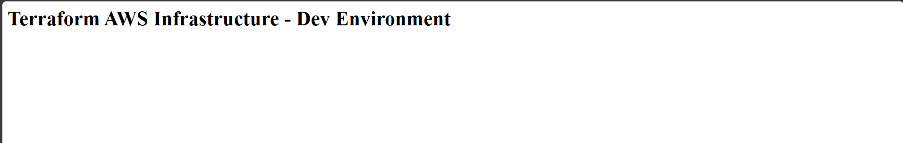
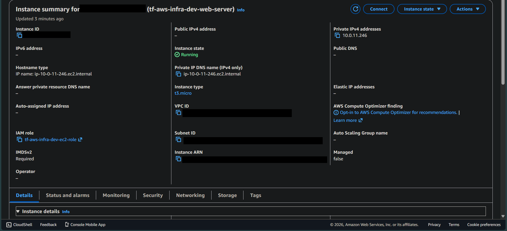
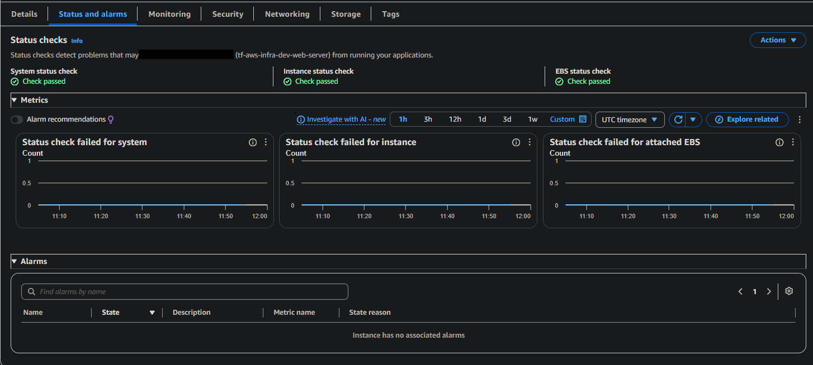
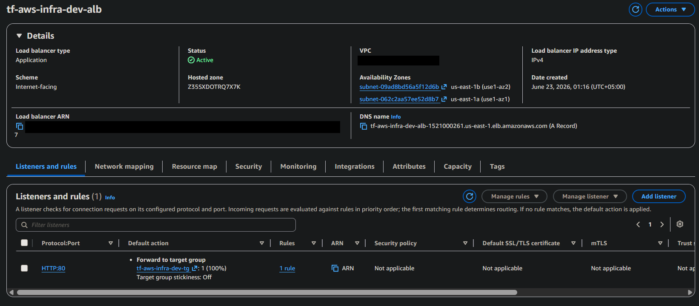
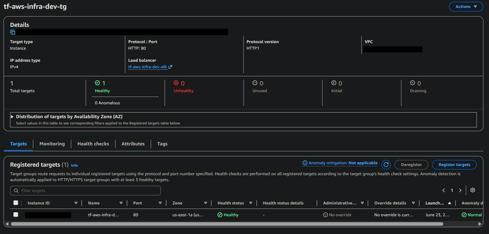
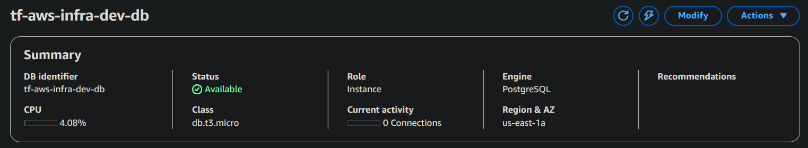
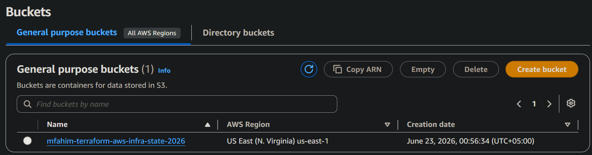
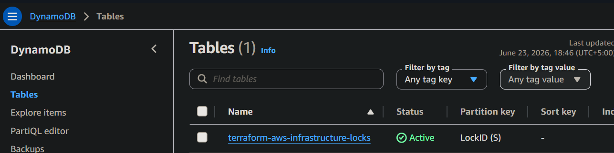
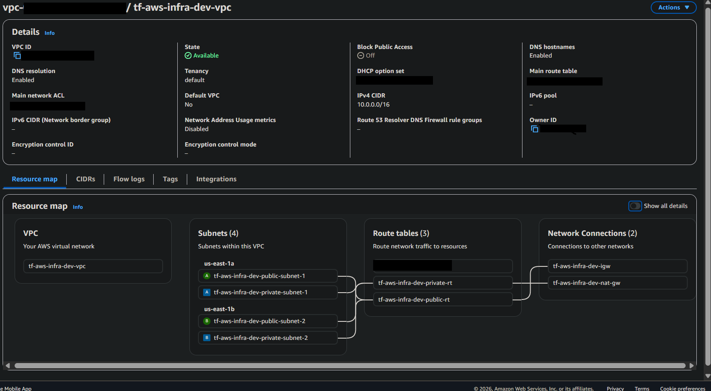
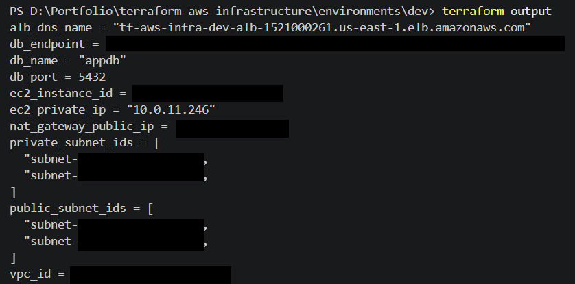

# Modular AWS Infrastructure Provisioning with Terraform

## 1. Project Overview
This repository is a comprehensive portfolio project demonstrating DevOps-focused AWS infrastructure provisioning. It implements modular, reusable Terraform code to deploy a highly available, secure cloud architecture, adhering to enterprise best practices.

## 2. Architecture Goal
The target architecture provisions a highly available environment across multiple availability zones:
- **VPC & Networking:** Public and Private Subnets, Internet Gateway (IGW), NAT Gateways.
- **Compute:** Scalable EC2 workloads without SSH, managed via Systems Manager (SSM).
- **Database:** Secure, multi-AZ RDS PostgreSQL with strict micro-segmentation.
- **Load Balancing:** Application Load Balancer (ALB) for resilient traffic routing.
- **State Management:** S3 Remote Backend and DynamoDB state locking.
- **Security & IAM:** Least-privilege IAM roles, Instance Profiles, and strict Security Groups.
- **Monitoring:** Centralized CloudWatch logging.

## 3. Tech Stack
- **Infrastructure as Code:** Terraform
- **Cloud Provider:** Amazon Web Services (AWS)
- **CI/CD:** GitHub Actions (Placeholder for Plan & Apply workflows)
- **Security Scanning:** Checkov

## 4. Current Status
- ✅ **Phase 1: Bootstrap layer implemented** (Secure S3 backend + DynamoDB locking)
- ✅ **Phase 2: VPC module implemented** (Highly available networking foundation)
- ✅ **Phase 3: IAM, ALB, and private EC2 implemented** (Zero-SSH web server architecture)
- ✅ **Phase 4: Private RDS PostgreSQL module implemented** (Fully secure, private database tier)
- ⏳ *Phase 5: Pending (CloudWatch module)*

## 5. Repository Structure
- `bootstrap/`: Secures Terraform state remotely with S3 and DynamoDB.
- `environments/`: Logical separations for infrastructure lifecycle (dev, prod).
- `modules/`: Standardized, reusable components (VPC, ALB, EC2, IAM, RDS, etc.).
- `docs/`: Expanded project documentation covering setup, architecture, and security.
- `.github/workflows/`: CI/CD definitions for automation.

## 6. Terraform Commands Used
This project was fully deployed and tested using the standard Terraform workflow:
- `terraform init` - Initialize the working directory containing Terraform configuration files.
- `terraform plan` - Create an execution plan, showing what actions Terraform will take.
- `terraform apply` - Execute the actions proposed in a Terraform plan.
- `terraform destroy` - Destroy all remote objects managed by a particular Terraform configuration.

## 7. Best Practices Followed
- **Modular Design:** Infrastructure split into discrete, manageable components.
- **State Isolation:** Distinct state files for different environments.
- **State Protection:** `prevent_destroy` hooks, S3 versioning, and state locking enabled.
- **Variable Validation:** Strict inputs to prevent configuration drift or empty strings.
- **Documentation:** Robust guidelines to ensure codebase scalability.

## 8. Security Notes
- Secrets and credentials are never hardcoded or committed to git.
- S3 public access is globally blocked, and data is encrypted at rest (AES256).
- **Zero-SSH:** EC2 instances are entirely private, rely on ALB for inbound traffic, and utilize AWS Systems Manager for secure shell access.
- **Private Data:** RDS databases reside in private subnets, enforce storage encryption, and accept traffic strictly from the EC2 instance tier.

## 9. Deployment Proof & Screenshots
The infrastructure was successfully deployed to AWS, verified, and subsequently destroyed to avoid ongoing billing charges. Below is the photographic proof of the deployment:

### Application Load Balancer Entrypoint

### EC2 Compute Layer

### Load Balancing Health

### Database Layer

### State Management

### Network Topology

### Terraform Execution

## 10. Cleanup Note
> **Note:** All resources (NAT Gateway, ALB, EC2, RDS, VPC) shown in the screenshots above were fully destroyed via `terraform destroy` immediately after testing to prevent ongoing hourly AWS charges.

## 11. CI/CD Plan
Future deployments will be managed entirely through GitHub Actions:
- **PR Creation:** Triggers `terraform fmt`, `terraform validate`, `terraform plan`, and Checkov security scanning.
- **Merge to Main:** Requires manual approval to trigger `terraform apply`.

## 12. Future Roadmap
- Phase 5: Configure CloudWatch.
- Phase 6: Fully activate GitHub Actions CI/CD.
