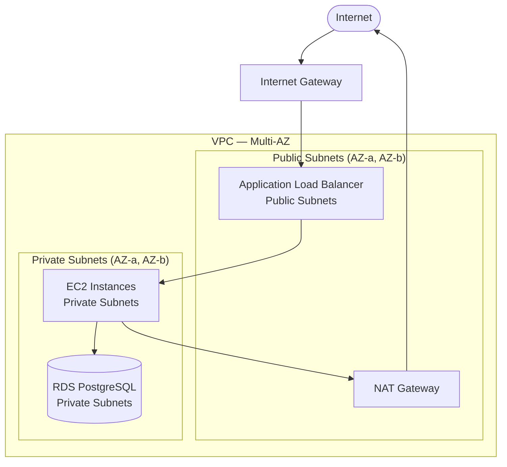
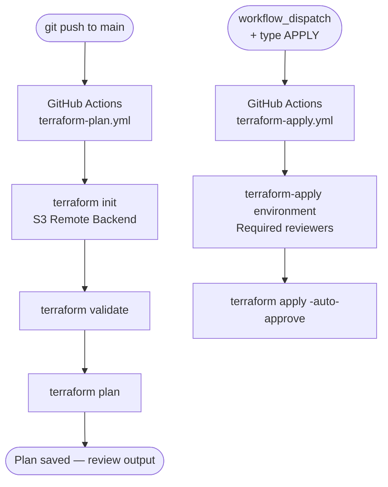
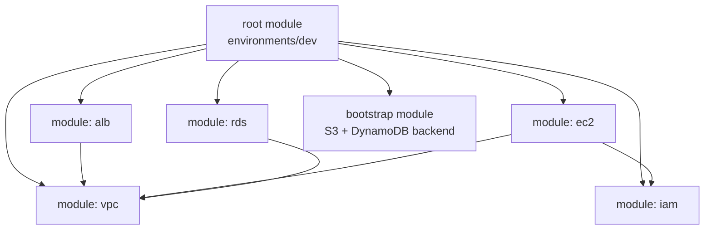
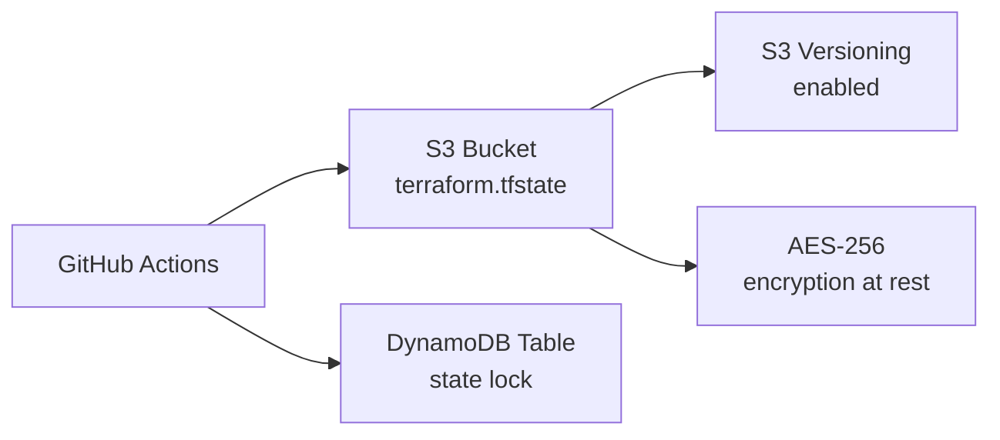

# Architecture — AWS Infrastructure with Terraform

## Infrastructure Overview

```mermaid
flowchart TD
    Internet([Internet]) --> IGW[Internet Gateway]
    IGW --> ALB[Application Load Balancer\nPublic Subnets]
    ALB --> EC2[EC2 Instances\nPrivate Subnets]
    EC2 --> RDS[(RDS PostgreSQL\nPrivate Subnets)]
    EC2 --> NAT[NAT Gateway] --> Internet
    subgraph vpc["VPC — Multi-AZ"]
        subgraph public["Public Subnets (AZ-a, AZ-b)"]
            ALB
            NAT
        end
        subgraph private["Private Subnets (AZ-a, AZ-b)"]
            EC2
            RDS
        end
    end
```

## CI/CD Pipeline

```mermaid
flowchart TD
    Push([git push to main]) --> Plan[GitHub Actions\nterraform-plan.yml]
    Plan --> Init[terraform init\nS3 Remote Backend]
    Init --> Validate[terraform validate]
    Validate --> PlanCmd[terraform plan]
    PlanCmd --> Done([Plan saved — review output])
    Manual([workflow_dispatch\n+ type APPLY]) --> Apply[GitHub Actions\nterraform-apply.yml]
    Apply --> Env[terraform-apply environment\nRequired reviewers]
    Env --> ApplyCmd[terraform apply -auto-approve]
```

## Terraform Module Structure

```mermaid
flowchart TD
    Root[root module\nenvironments/dev] --> VPC[module: vpc]
    Root --> EC2[module: ec2]
    Root --> ALB[module: alb]
    Root --> IAM[module: iam]
    Root --> RDS[module: rds]
    Root --> Bootstrap[bootstrap module\nS3 + DynamoDB backend]
    EC2 --> IAM
    ALB --> VPC
    EC2 --> VPC
    RDS --> VPC
```

## Remote State Architecture

```mermaid
flowchart LR
    CI[GitHub Actions] --> S3[S3 Bucket\nterraform.tfstate]
    CI --> DDB[DynamoDB Table\nstate lock]
    S3 --> Versioning[S3 Versioning\nenabled]
    S3 --> Encryption[AES-256\nencryption at rest]
```

[← README](../README.md)
